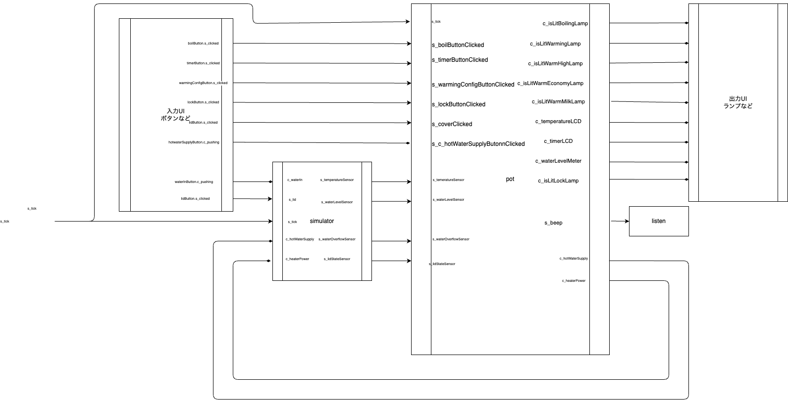

# app

FRPネットワーク全体とUI全体の構築を行う。

入力とpotとsimulatorと出力UIを接続する。

## ネットワーク図

## 入力

引数として

- `s_tick`: 前回のtickの発火からの経過時間（ミリ秒）を持って発火するストリーム。

内部的にUIからの入力として

- `s_hoge`
- `waterInButton.c_pushing`: 「水追加」ボタンの押下状態
- `boilButton.s_clicked`: 「沸騰」ボタンが押されると発火
- `timerButton.s_clicked`:「タイマー」ボタンが押されると発火
- `warmingConfig.s_clicked`: 「保温設定」ボタンが押されると発火
- `lockButton.s_clicked`: 「解除」ボタンが押されると発火
- `lidButton.s_clicked`: 「ふた」ボタンが押されると発火
- `hotWaterSupplyButton.s_clicked`: 「給湯」ボタンが押されると発火

## 出力

返り値としてはDOM要素のラッパーであるViewItemを返す。
それとは別に出力UIと接続してあり、内部の状態を返り値となっているDOM要素にレンダリングしている。

そのためネットワーク図上では出力値はない。