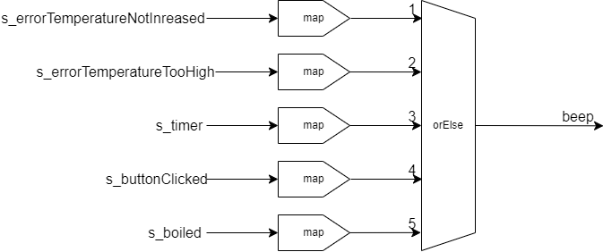

# beep

## 概要

ビープのストリームをまとめ、またストリームによってビープの種類を決める。

## 仕様

ビープは以下の２種類ある。
・30秒間ビープ音を鳴らし続けるビープ（以下ロングビープ）
・短いビープを指定回数鳴らすビープ（以下ショートビープ）

エラーが発生したときはロングビープを鳴らす。
ボタンを押されたときはショートビープを一回鳴らす。
タイマーのタイムアウト時、もしくは沸騰時にショートビープを３回鳴らす。
