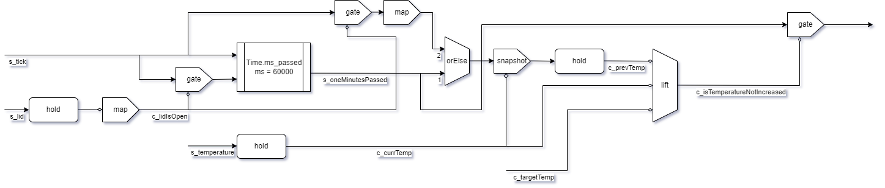

# error

ポットの動作上のエラー

## error_temperature_not_increased

加熱するべきときに温度が上がらず1分が経過した際に発生するエラー

### ネットワーク図

### 入力

- `s_tick`
- `s_temperature`
- `c_targetTemp`

### 出力

エラーが発生した際に発火するストリーム。

### 動作

内部的に1分ごとに発火するストリームを保持する。
このストリームが発火するたびに以下の動作をする。

1. 現在の温度と1分前の温度を取得する。
2. 現在温度が目標温度より5度低く、1分前より温度が下がっていたらエラーとして出力ストリームを発火させる。

## error_temperature_too_hight

温度が異常に高いときに発生するエラー

### ネットワーク図

### 入力

- `s_temperature`

### 出力

エラーが発生した際に発火するストリーム。

### 動作

現在の温度が110度を超えたら発火するストリームを返す。
