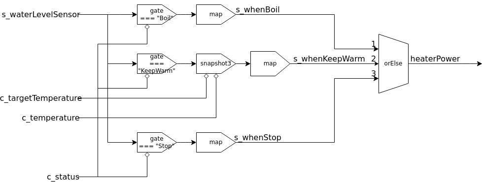

# heaterPower

## ネットワーク図

## 概要

加熱量を決めるモジュール。

## 入力

- `s_waterLevelSensor`
- `c_targetTemperature`
- `c_status`
- `c_temperature`

## 仕様

ポットが沸騰状態であれば、最大パワー（1000W）で加熱する。
ポットが保温状態であれば、目標温度と現在温度の差と水量で熱量を決める。
ポットが停止状態であれば、加熱量を0にする。
