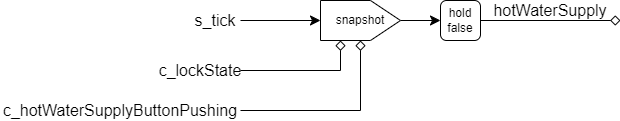

# hotWaterSupply

給湯状態を管理するモジュール

## 入力

・`s_tick` ティック
・`c_lockState` ロック解除状態かどうかのセル。trueの時ロック解除状態。
・`c_hotWaterSupplyButtonPushing` 給湯ボタンが押されているかどうかのセル。

## 動作

`s_tick`を受け取り、そのたびに`c_lockState`と`c_hotWaterSupplyButtonPushing`のANDをとり、それをholdしたものを返す。
