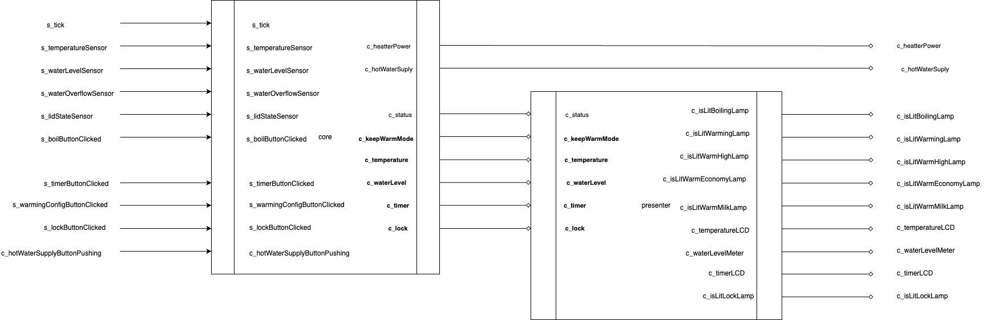

# pot

## ネットワーク図

## 概要

simulatorやUIからの入力をcoreに流し込んでpotの制御を行う。
また、presenterにpotの出力を流し出力UI用にデータの加工を行う。

出力としてはsimulatorへとループするものと、presenterからの出力UIへのものがある

## 入力

- `s_tick: Stream<number>`
  - ティック毎に経過時間を持って発火する
- `s_temperatureSensor: Stream<number>`
  - ティック毎に水温を持って発火する
- `s_waterLevelSensor: Stream<0 | 1 | 2 | 3 | 4>`
  - ティック毎に水位を持って発火する
- `s_waterOverflowSensor: Stream<boolean>`
  - ティック毎に水溢れしているかどうかを持って発火する
  - true -> 水溢れ
  - false -> していない
- `s_lidStateSensor: Stream<LidState>`
  - ティック毎にふたの状態を持って発火する
  - Open, Close
- `s_boilButtonClicked: Stream<Unit>`
  - 「沸騰」ボタンを押した際に発火する
- `s_timerButtonClicked: Stream<Unit>`
  - 「タイマー」ボタンを押した際に発火する
- `s_warmingConfigButtonClicked: Stream<Unit>`
  - 「保温設定」ボタンを押した際に発火する
- `s_lockButtonClicked: Stream<Unit>`
  - 「解除」ボタンを押した際に発火する
- `s_cover: Stream<Unit>`
  - 「ふた」ボタンを押した際に発火する
- `c_hotWaterSupplyButtonPushing: Cell<boolean>`
  - 「給湯」ボタンを押した際に発火する

## 出力

- `c_heaterPower: Cell<number>`
  - ヒーターで出力するW数を持つ
- `c_hotWaterSuply: Cell<boolean>`
  - 給湯中かどうかを持つ
  - true -> 給湯中
  - false -> していない
- `c_isLitBoilingLamp: Cell<boolean>`
  - 「沸騰」ランプの点灯状態
  - true -> 点灯
  - false -> 消灯
- `c_isLitWarmingLamp: Cell<boolean>`
  - 「沸騰」ランプの点灯状態
- `c_isLitWarmHighLamp: Cell<boolean>`
  - 「沸騰」ランプの点灯状態
- `c_isLitWarmEconomyLamp: Cell<boolean>`
  - 「沸騰」ランプの点灯状態
- `c_isLitWarmMilkLamp: Cell<boolean>`
  - 「沸騰」ランプの点灯状態
- `c_temperatureLCD: Cell<string>`
  - 「沸騰」ランプの点灯状態
- `c_waterLevelMeter: Cell<WaterLevel>`
  - 「沸騰」ランプの点灯状態
- `c_timerLCD: Cell<string>`
  - 「沸騰」ランプの点灯状態
- `c_isLitLockLamp: Cell<boolean>`
  - 「沸騰」ランプの点灯状態
- `s_beep: Stream<BeepType>`
  - ビープ音を再生させるタイミングで、音の種類を持って発火