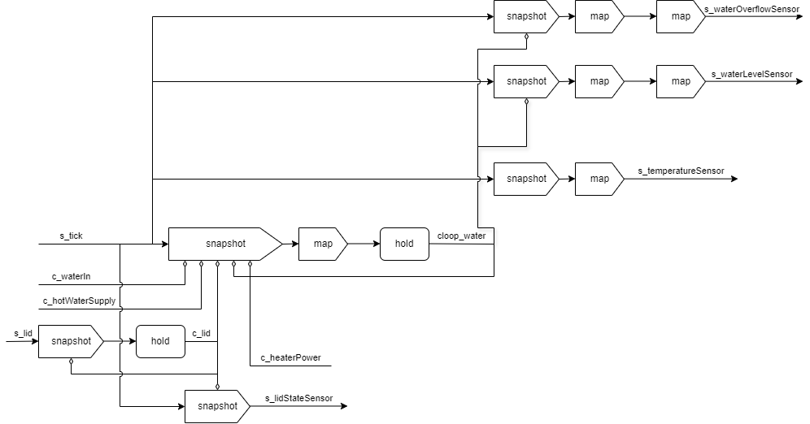

# simulator

ポットの動作を管理する。

## ネットワーク図

## 入力

- `c_waterIn`
- `s_tick`
- `c_heaterPower`
- `c_hotWaterSupply`
- `s_lid`

## 出力

各ストリームはティックごとに発火する。

- `s_temperatureSensor` 現在の水温。
- `s_waterLevelSensor` 現在のポット内の水量。4段階で表される。
- `s_waterOverflowSensor` ポットから水が溢れているかどうか。
- `s_lidStateSensor` 蓋が開いているか閉じているか。

## 動作

内部に水量と水温、蓋の状態を保持する。各ティックごとに以下の動作をする。

1. 水を入れるべきなら蓋の状態を見て内部の水量を増やす。
2. 水を排出するべきなら内部の水量を減らす。
3. 各種センサ類を必要に応じて発火させる。
