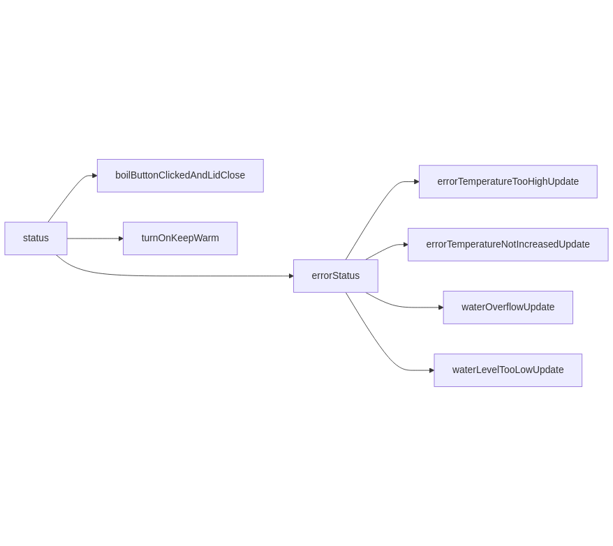
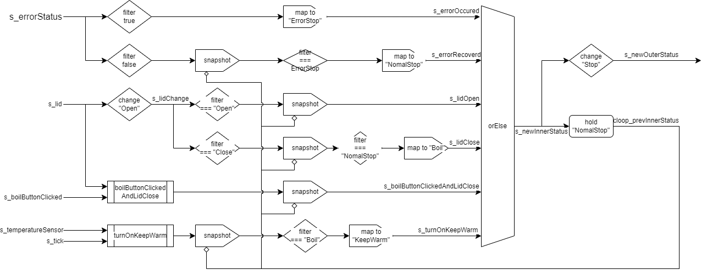

# status

沸騰状態、保温状態、停止状態のどの状態なのかを出力するストリームを作る。

## 入力

- `s_temperatureSensor: Stream<number>`
  - 温度センサーから値を受け取るたびに発火する。
  - 現在の実装では`s_tick`と同じタイミング、つまり200ミリ秒ごとに発火する。
- `s_boilButtonClicked: Stream<Unit>`
  - 沸騰ボタンを押下した際に発火する。
- `s_lid: Stream<LidState>`
  - フタを空け閉めした際に発火する。
  - 開いている状態、閉じている状態の2種類の値を取りうる。
- `s_waterOverflowSensor: Stream<boolean>`
  - 満水センサーから値を受け取るたびに発火する。
  - 現在の実装では`s_tick`と同じタイミング、つまり200ミリ秒ごとに発火する。
- `s_waterLevelSensor: Stream<WaterLevel>`
  - 水位センサーから値を受け取るたびに発火する。
  - 0、1、2、3、4の5種類の値を取りうる。
  - 現在の実装では`s_tick`と同じタイミング、つまり200ミリ秒ごとに発火する。
- `s_errorTemperatureNotIncreased: Stream<Unit>`
  - 温度上がらずエラーが起きたときに発火する。
  - 温度上がらずエラーの条件が揃った際に1分毎に発火する。
- `s_errorTemperatureTooHigh: Stream<Unit>`
  - オーバーヒートした状態のときに随時発火する。
  - 現在の実装では`s_temperature`(温度センサーのストリーム)が発火した際に、条件が揃っていればこのエラーも発火する。
- `s_tick: Stream<number>`
  - 200ミリ秒ごとに発火する。

## 出力

- `Stream<Status>`
  - ステータスを持ったストリームを返す。
  - 沸騰、保温、停止の3種類の値を取りうる。
  - ステータスが切り替わる際にのみ発火する。
    - 例えば、保温モードに切り替わるタイミングのストリームが欲しければ、ステータスの出力のストリームに対してfilterをかけるだけで済む。

## 仕様

### 本に書いてあった仕様

- 沸騰ボタンを押したとき、温度制御可能な水位ならば沸騰状態になる。
- ふたが閉じられたとき、温度制御可能な水位ならば沸騰状態になる。
- 沸騰状態で100度に達してから3分間経ったら、保温状態になる。
- 高温エラー・温度上がらずエラーが出たたときには、停止状態になる。
- フタが開いたとき、停止状態になる。
- 満水センサがONのとき、停止状態になる。

### 内部的な状態

ポットの動作が停止する要因として、フタが開けられたような正常な場合とエラーが発生したなどの異常な場合の2つが考えられる。これらを区別するために、内部では4種類の状態を保持している。

- 正常停止状態
- 異常停止状態
- 沸騰状態
- 保温状態

これらの状態は外部へ出力される際に次のように変換される。

- 停止状態 <- 正常停止状態 | 異常停止状態
- 沸騰状態 <- 沸騰状態
- 保温状態 <- 保温状態

### 異常停止状態について

異常停止状態になる原因とその復旧については、次の4種類の要因がある。

- 高温エラー
- 温度上がらずエラー
- 満水センサがON
- 水位が0

各要因について、どの要因が異常停止状態なのかを記録しておく。例えば要因Aによって異常停止状態になったとき、要因Bが復旧したというストリームが発火したとしても、要因Aは異常停止状態のままになる。どれか1つの要因でも異常停止状態ならば、全体としても異常停止状態となる。

### 異常停止状態からの復旧について

各原因で異常停止状態になった際には、原因ごとに異なる復旧要因がある。

- 高温エラーのとき
  - 低温になれば良いので、`s_temperatureSensor`が一定値以下になったら復旧する。
- 温度上がらずエラーのとき
  - フタが閉まったら復旧する。
  - フタを開けて異物などを除去したと考え、この仕様にした。
- 満水センサがONのとき
  - 満水センサがOFFになれば復旧する。
- 水位が0のとき
  - 水位が1以上に慣れば復旧する。

## 実装

statusは図のような関数の呼び出しを行っている。

### 各関数の説明

- boilButtonClickedAndLidClosed
  - フタが閉じられていて、かつ沸騰ボタンが押されたときのみ発火するストリームを返す。
- turnOnKeepWarm
  - 100度に達してから3分後に発火するストリームを返す。
  - 今はデバッグ用に10秒後に発火するようにしている。
- errorStatus
  - 異常停止状態になったことと、異常停止状態から復旧したことを知らせるストリームを返す。
  - 今の実装では、ストリームは随時発火するようになっている。
- 各Update関数
  - 各Update関数のストリームは、条件を満たす際に随時発火する。
  - errorTemperatureTooHighUpdate
    - オーバーヒートした祭と、オーバーヒートからの復旧の際に発火するストリームを返す。
  - errorTemperatureNotIncreasedUpdate
    - 温度上がらずエラーが発生した際と、温度上がらずエラーからの復旧の際に発火するストリームを返す。
  - errorWaterOverflowUpdate
    - 満水センサがONになったときと、OFFになったときに発火するストリームを返す。
  - errorWaterLevelTooLowUpdate
    - 水位が0のときと、1以上になったときに発火するストリームを返す。

### status

状態遷移の各イベントに対して、状態遷移を行った新しい状態を作る。新しい状態をorElseで優先順位を付けながらmergeしていく。mergeした結果に対して、前回から変更があった際にのみ発火するようにするchange関数を使い、`s_newOuterStatus`を作る。`cloop_innnerStatus`というセルループを使い、現在の状態を保持する。

### boilButtonClickedAndLidClosed

フタが閉じられていて、かつ沸騰ボタンが押されたときのみ発火するストリームを返す。

### turnOnKeepWarm

100度に達してから3分後に発火するストリームを返す。

ms_passedは第1引数で指定された間隔でストリームを発火させる。時間経過は第2引数の`s_tick`で渡される。第3引数の`s_forceReset`が発火した際には、時間経過をリセットする。

### errorStatus

異常停止状態になったことと、異常停止状態から復旧したことを知らせるストリームを作る。内部で$2^4 = 16$パターンの状態を持っていて、それぞれの要因ごとに障害と復旧を管理している。戻り値のストリームは、全ての要因が復旧した際にfalseを、異常停止状態になった際にtrueを発火する。

各要因の障害・復旧は同じ論理的時刻で行われることがある。要因Aと要因Bで考えると、図のように要因Aと要因Bが同じ論理的時刻で行われることがある。なので、要因Aが障害になったという情報と、要因Bが障害になったという情報を両方残すようにmergeしている。

### errorTemperatureTooHighUpdate

オーバーヒートした際と、オーバーヒートからの復旧の際に発火するストリームを返す。

### errorTemperatureNotIncreasedUpdate

温度上がらずエラーが発生した際と、温度上がらずエラーからの復旧の際に発火するストリームを返す。

### errorWaterOverflowUpdate

満水センサがONになったときと、OFFになったときに発火するストリームを返す。

### errorWaterLevelTooLowUpdate

水位が0のときと、1以上になったときに発火するストリームを返す。

