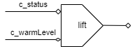

# target_temperature

現在の状態から目標温度を決定する。

## ネットワーク図

## 入力

- `c_status`
- `c_warmLevel`

## 出力

目標とする温度を保持するセル。

## 動作

目標温度を`c_status`の値に応じて以下のようにして決定する。

- `Boil`なら100度
- `KeepWarm`なら`c_warmLevel`
  - `High`のとき98度
  - `Economy`のとき90度
  - `Milk`のとき60度
- `Stop`のとき0度
