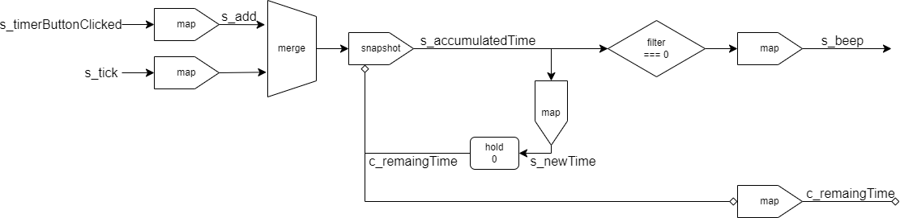

# timer

タイマーボタンの入力と、時間経過とともに発火するストリームから、残り時間を表すセル及びビープ音を鳴らすストリームを作る。

## 入力

- `s_timerButtonClicked: Stream<Unit>`
	- タイマーボタンを押下した際に発火する。
- `s_tick: Stream<number>`
	- 時間経過と共に発火する。
	- 現在の実装では200ミリ秒ごとに発火する。

## 出力

- `c_remainigTime: Cell<number>`
	- タイマーの残り時間を出力する。単位は分。
- `s_beep: Stream<Unit>`
	- タイマーの残り時間が0になったらビープ音を鳴らす。

## 仕様

- タイマーボタンを押下した際には、残り時間に1分追加する。残り時間が60分を超えた際には、60分で割ったあまりを残り時間とする。
- `s_tick`によって経過時間を受け取り、残り時間を減らす。残り時間が0になったらビープ音を鳴らす。

## 実装

`c_remainingTime`というセルループがあり、そこに残り時間を保持している。2つの入力を残り時間への差分に変換し、mergeで足して`s_accumulatedTime`というストリームを作る。`s_beep`はそれをフィルターで処理したものを返す。`c_remainingTime`はさらに60分で割ったあまりを取ることで、60分を超えた時間を正規化している。
